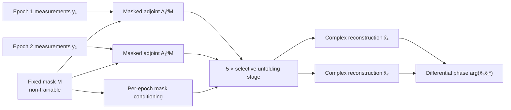

<p align="center">
  
</p>

<p align="center">
  <a href="https://www.python.org/"></a>
  <a href="https://pytorch.org/"></a>
  
  
  <a href="LICENSE"></a>
</p>

<p align="center">
  <strong>Physics-driven, exchange-equivariant deep unfolding for phase-preserving bitemporal SAR reconstruction.</strong>
</p>

DP-JMRNet jointly reconstructs two complex SAR images from discontinuously sampled aperture measurements while explicitly preserving their differential phase. It combines a matrix-free wideband SAR operator, dual data-consistency updates, a shared complex prior, and coherence-aware selective interaction.

> [!IMPORTANT]
> The sampling mask in this release is **fixed**. It is stored as a non-trainable model buffer, is excluded from gradient descent, and is never updated during training or inference. The supplied configuration uses the same mask for both epochs, \(M_1=M_2=M\), with \(K=104\) selected positions from \(N=256\) candidates.

## Highlights

- **Phase-preserving bitemporal reconstruction** — optimizes complex, amplitude, raw-phase, and differential-phase objectives.
- **Matrix-free SAR physics** — evaluates the wideband forward/adjoint pair without constructing a dense system matrix.
- **Exchange-equivariant interaction** — swapping the two epochs swaps the two reconstructed outputs.
- **Selective coupling** — cross-epoch information is suppressed when local coherence vanishes or data-consistency residuals conflict.
- **Reproducible simulation** — regenerates the complete 4,000-sample dataset from a versioned configuration and fixed random seed.
- **Sealed test protection** — the default dataset loader cannot open the final test split without explicit confirmation.

## Method at a glance

For epochs \(t\in\{1,2\}\), the observation model is

\[
y_t = M A_t x_t + n_t,
\]

where \(A_t\) is the wideband SAR forward operator and \(M\) is the shared, fixed aperture mask. Differential phase follows

\[
\Delta\phi = \arg\!\left(x_2x_1^*\right).
\]

Each of the five unfolding stages applies pre-prior data consistency, a shared complex-valued prior, exchange-equivariant selective interaction, and post-coupling data consistency.



Mask conditioning lets the reconstructor adapt its step sizes and regularization to a known acquisition pattern; it does **not** optimize the sampling locations.

## Repository layout

```text
.
├── assets/                         README artwork
├── configs/data/                   deterministic dataset specification
├── data/simulated_dataset/         bundled 32/8/8 example dataset
├── scripts/generate_dataset.py     full dataset generator and integrity audit
├── scripts/train.py                training entry point
├── scripts/validate.py             checkpoint evaluation entry point
├── src/coherent_sar/               model, physics operator, and data pipeline
├── tests/                          numerical and architectural tests
├── config.json                     quick example configuration (fixed K=104)
└── config.full.json                full-dataset training configuration (fixed K=104)
```

## Quick start

Python 3.10 or newer is required. Install a PyTorch build suitable for your CPU or CUDA environment, then install the project:

```bash
python -m venv .venv
python -m pip install --upgrade pip
python -m pip install -e ".[test]"
python -m pytest
```

Run a one-step end-to-end check on the bundled example dataset:

```bash
python scripts/train.py --steps 1
```

The bundled example contains 32 training, 8 validation, and 8 held-out samples in the same schema as the complete dataset.

## Generate the complete dataset

The full dataset is generated locally rather than stored as a 6.14 GiB Git object. Its specification is versioned in [`configs/data/final_sar_dataset_256_v1.json`](configs/data/final_sar_dataset_256_v1.json).

Generate all 4,000 samples:

```bash
python scripts/generate_dataset.py --mode full
```

This creates `data/final_sar_dataset_256/` with the following parent-disjoint splits:

| Split | Samples | Parent scenes | Purpose |
|:--|--:|--:|:--|
| Train | 3,000 | 188 | Parameter optimization |
| Validation | 500 | 32 | Model selection and analysis |
| Sealed test | 500 | 32 | Final evaluation only |

For a smaller generator check, use:

```bash
python scripts/generate_dataset.py --mode dry
```

The generator performs integrity checks during creation and writes `generation_audit.json`, manifests, per-sample SHA-256 hashes, stable truth-content hashes, split statistics, and deterministic noise-seed banks. A reference full run took approximately 852 seconds; runtime is hardware-dependent.

To generate into a custom empty directory:

```bash
python scripts/generate_dataset.py --mode full --output /path/to/dataset
```

### Sample contents

Each `.npz` sample stores:

- `x1`, `x2`: two native `256 × 256` complex64 SAR truth images;
- `delta_phi_gt`: wrapped differential-phase ground truth;
- `phase_weight`: continuous phase-reliability weights;
- `hard_valid_mask`: binary phase-validity mask;
- sample, parent-scene, crop, split, difficulty, and generation metadata.

Parent scenes are assigned to train, validation, and test **before** patches are cropped. Each `1024 × 1024` parent contributes at most sixteen non-overlapping `256 × 256` patches, preventing parent-scene leakage across splits. Masked observations are generated online; the dataset contains clean complex truth rather than mask-specific measurements.

## Train

Quick example training:

```bash
python scripts/train.py --config config.json
```

Full-dataset training after generation:

```bash
python scripts/train.py --config config.full.json
```

Training writes `best.pt`, `last.pt`, and `metrics.json` under the configured output directory. A CUDA-capable GPU is recommended for the full five-stage `256 × 256` model.

## Validate a checkpoint

Example configuration:

```bash
python scripts/validate.py --config config.json --checkpoint outputs/best.pt
```

Full-dataset configuration:

```bash
python scripts/validate.py --config config.full.json --checkpoint outputs/full_k104/best.pt
```

Validation reports weighted differential-phase RMSE, amplitude NMSE, and complex NMSE.

## Reproducibility safeguards

- Dataset base seed: `2026080101`.
- Parent-scene-first split assignment with zero cross-split parent overlap.
- Deterministic train/validation/test noise-seed banks for 10, 15, 20, 25, and 30 dB.
- Per-sample numerical truth hashes independent of archive metadata.
- Fixed binary sampling mask stored in the model state without gradients.
- Tests for complex adjoint consistency, masked-operator gradients, exchange equivariance, independent fallback, gate behavior, model backpropagation, and fixed-mask immutability.

Run the full test suite with:

```bash
python -m pytest
```

## Scope and limitations

The included dataset is a controlled coherent complex SAR simulation designed for reproducible method development. It is not a substitute for broad validation on independently acquired SAR scenes. The repository therefore makes no claim of universal performance across sensors, terrain types, sampling geometries, or all reconstruction metrics.

## License

Released under the [MIT License](LICENSE).
